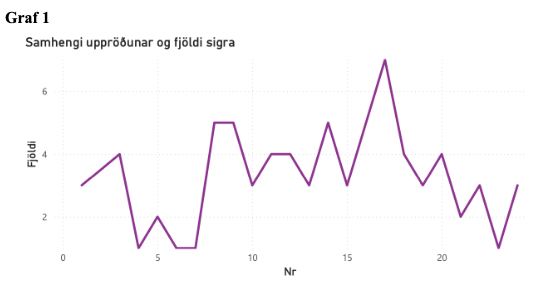
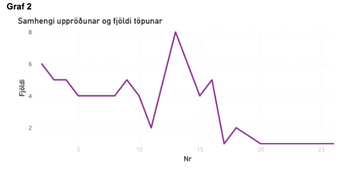
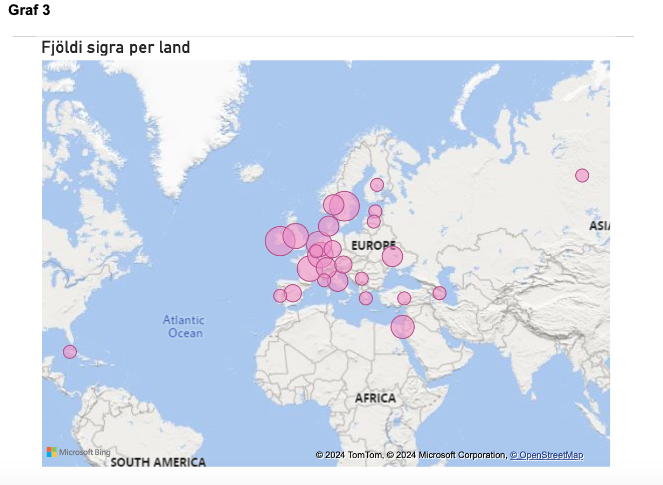
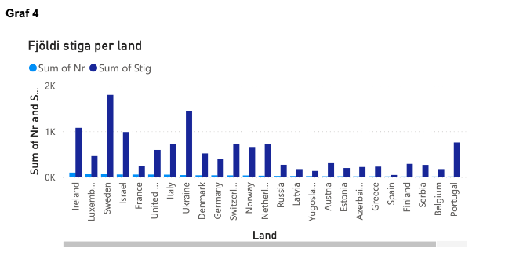
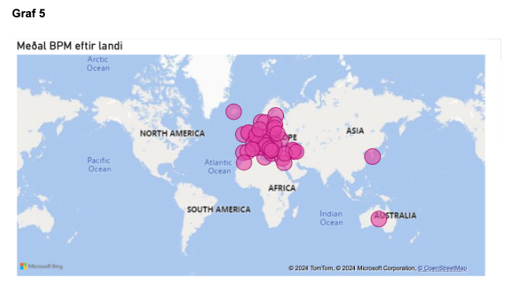
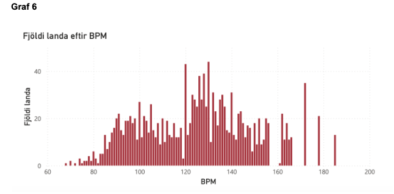
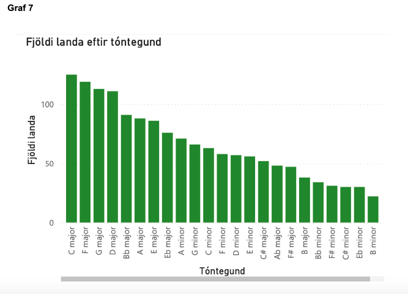
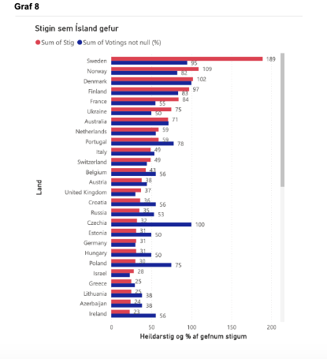
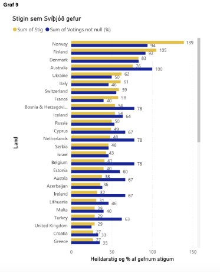

Eurovision

1. Verkefnalýsing
   Verkefnið fól í sér að útbúa og hanna mælaborð sem lýsti samanburði milli Svíþjóðar og Íslands í söngvakeppninni
   Eurovision á 20 ára tímabili eða milli 2004-2024. Þá var leitað að gagnagrunnum með nytsamlegum upplýsingum á netinu
   sem
   voru síðan skrapaðar með gerð segða (regex). Ástæðan af hverju ofantöld lönd voru valin, þau taka keppninni hvað
   alvarlegast af öllum löndum en hafa samt sem áður notið mjög ólíkrar velgengni í gegnum árin.

2. Lýsing á gagnaöflun – Hvaðan komu gögnin og hvernig voru þau fengin?
   Gögnin voru sótt af síðunni: https://eschome.net/index.html.
   Síðan eru háð þýskum höfundarrétti (Markus Flecht) og er niðurhal af þessari síðu eingöngu leyfð til einkarekinna,
   óviðskiptalegra nota.
   Einnig voru gögn sótt af Github: https://github.com/josago97/EurovisionDataset  (tone og bpm)
   https://github.com/Spijkervet/eurovision-dataset (jury vs tele)
   Heimilt er að vinna með gögnin þ.e. nota, afrita, breyta, sameina, birta, dreifa samkvæmt leyfisskilmála.

Fyrir hvern einasta gangagrunn, var vefslóðin afrituð og sett inn í tiltekinn kóðabút sem gerður var í VSCode þar sem
gögnin breyttust í csv skrá. Engar áskoranir tengdust gagnaöfluninni, gekk mjög smurt fyrir sig.

3. Gagnavinnsla – Hvernig voru gögnin meðhöndluð?
   Eins og áður kom fram var gerður mismunandi kóði fyrir hvern gagnagrunn (töflu) sem sótt var af síðunni þar sem
   gögnin
   voru sett upp á ólíkan hátt; annars vegar voru gögnin sótt með venjulegri get-fyrirspurn og hins vegar með
   post-fyrirspurn með breytum. Það var lítil áskorun.
   Segðir (regex) voru gerðar til að hreinsa og skrapa upplýsingarnar á síðunni inn á Regex101.
   Unnið var með csv skrárnar inn í Power BI þar sem mælaborðið var hannað.

Þegar gögnin voru sótt af GitHub þá var textinn í formi JSON eða CSV. Hann var parse-aður til þess að koma því í pandas
DataFrame. Þegar því var lokið var síðan sótt viðeigandi dálka frá DataFrame-inu áður en því var loks vistað í CSV skrá.

4. Markverðustu niðurstöður – Hverjar voru helstu niðurstöður?
   Ýmsar áhugaverðar niðurstöður komu í ljós við gerð mælaborðsins. Þar má meðal annars sjá að hvernig uppröðun atriða
   getur haft áhrif á velgengni landa í keppninni; best er að vera 16. í röðinni eða seinna. Svíþjóð og Írland hafa
   unnið
   oftast eða 8 sinnum hvor, flest lög eru í Dúr og með taktgildinu (bpm) 12-130 sem gefur til kynna að flest lög eru
   hress
   og flokkast sem electro-pop eða disco lög. Einnig voru stig Íslands borin saman við Svíþjóðar og kom þá í ljós að
   Ísland
   gefur Svíþjóð flest sín stig en Ísland er ekki nema númer 10 hjá Svíþjóð. Áhugavert var þó að sjá að Monakó og
   Ungverjaland gefa Íslandi hlutfallslega mörg stig. Annars eiga Ísland og Svíþjóð það sameiginlegt að gefa og fá sín
   stig
   frá Norðurlöndunum.

Hér að ofan má sjá tvö gröf sem sýna bæði númer atriða (x-ás) og fjölda þeirra sem unnu eða töpuðu (y-ás). Gröfin segja
því númer hvað atriðið var sem vann eða tapaði. Sjá má að flest lönd sem hafa unnið, 7 talsins, hafa verið sautjánda
atriðið upp á svið í þeirri röð sem atriðin stigu fram. Á hinn bóginn hafa flest lönd tapað, 8 talsins, sem hafa verið
þrettándu upp á svið (nr 13 í röðinni). Aðeins fjögur sæti aðskilja það að vera í því sæti sem flestir hafa tapað í og
því sæti sem flestir hafa unnið.

Skemmtilegt að sjá á fyrra grafinu (fjöldi sigra), því fyrr sem löndin koma fram á svið, því sjaldnar vinnur það. Það
gæti stutt þá kenningu að keppendur eigi það til að gleyma atriðum sem eru framarlega eftir því sem líður á keppnina.
Á seinna grafinu (fjöldi tapa) má sjá að eftir þrettánda atriði, minnka líkurnar talsvert á því að tapa. Atriði sem eru
um miðja keppni eru, samkvæmt grafinu, líklegri til taps.
Því er líklegt að stjórnendur viilji dreifa sigurstranglegum atriðum jafnt yfir keppnina.

Þegar gagnvirka kortið er skoðað að ofan sést að Svíþjóð og Írland hafa unnið Eurovision oftast eða sjö sinnum hvor.
Það kemur ef til vill ekki mörgum á óvart að sjá Svíþjóð þar sem hún er ein mesta pop- og Eurovision þjóð. Það gæti þó
komið mörgum á óvart að Írland sé þar á meðal þar sem þeim hefur ekki gengið sérlega vel seinustu ár og unnu keppnina
seinast árið 1996.
Fróðlegt er að sjá á stöplaritinu, hvernig stigagjöfin hefur breyst seinustu ár. Þar sést að Úkraína hefur samanlagt
fengið heil 368 fleiri stig en Írland þrátt fyrir að hafa unnið keppnina aðeins þrisvar sinnum. Það gæti þó orsakast
vegna breytingu á stigagjöf eftir að En það skýrist á því að Úkraína hefur unnið keppnina tvisvar sinnum nýlega, eftir
að stigagjöfin breyttist; dómara- og símaatkvæði eru talin í sitthvoru lagi og því möguleiki á að fá fleiri stig en
áður.
Einnig hafa lönd bæst við keppnina á milli ára og því eru fleiri stig í boði nú en áður fyrr (á hápunkti Írlands)

Fróðlegt var að sjá út frá grafi 6 um bpm (beats per minute) hversu ólík lög eru send þar sem mikil dreifing er á takti.
Algengast er að lönd sendi inn lög með bpm 120 og 130 sem gefur til kynna að lög eru oft electro-pop eða disco. Einnig
sést talsvert um róleg lög eða ballöður með bpm milli 70-100. Áhugavert er að sjá að 69 lög hafa verið með bpm yfir 69
sem myndi teljast til þungarokks eða mjög hröð tekknólög.
Út frá gagnvirka kortinu (grafi 5) sést að flest lönd senda lög með meðalgildi-bpm á bilinu 120-130 sem er hvorki taktur
hraðra né rólegra laga.
Á grafi 7 um tóntegundir sést að vinsælast sé að senda lög sem eru í Dúr í staðinn fyrir moll. Það kemur ekki á óvart
það sem dúr er oft talið vera glaðlegra og lætur fólki líða betur en moll. Einnig eru flest lög samin í einföldum
tóntegundunum (C Dúr, F dúr og G dúr) sem getur haft áhrif á hlustun þar sem tónlistin er ekki flókin.

Gröfin tvö að ofan gefur til kynna að bæði Ísland og Svíþjóð gefa atkvæði sín helst til Norðurlanda. Það kemur ef til
vill ekki á óvart þar sem nágrannalönd styðja oft hvort annað í keppninni. Þó er mjög áhugavert að sjá að Ísland hefur
gefið Tékklandi stig við hvert einasta tækifæri, það má sjá á bláu súlunni sem stendur fyrir sum of voting not null (%)
eða hlutfall þess að gefa stig sem er ekki 0..
Má sjá að Svíþjóð er í miklu uppáhaldi hjá Íslendingum en það sama gildir ekki um viðhorf Svía á Íslandi í keppninni þar
sem Ísland er 10.landið á listanum. Svíþjóð hefur gefið Noregi flest stigin en hlutfallslega mest til Ástralíu þar sem
bláa súlan er 100%.

Sama gildir með stigin sem Ísland og Svíþjóð fá frá öðrum löndum. Flest stig fást frá Norðurlöndunum; Finnlandi, Noregi
og Danmörku. Gaman er að sjá að Ísland og Svíþjóð eru í fjórða sæti hjá hvort öðru.

5. Mælaborðið – Hvað var það gert og hver var tilgangur þess?

Tilgangur þessa mælaborðs var annars vegar að sjá sjónrænt þróun keppninnar; fjöldi keppanda, áhorf, kosningar og
vinsældir og hins vegar muninn á velgengni Svíþjóð og Íslandi í söngvakeppninni. Hlaðað var niður csv skrám af Github:
Upplysingaverkfraedi/capstone-riverlands
Unnið var með skrárnar í Power BI þar sem þær eru mjög aðgengilegar og gott að vinna með slík gögn. Auðvelt var að draga
dálka úr csv.skránum (sem birtust á töfluformi) inn í alls kyns gröf sem x ás og y ás. sem voru valin. Þó þurfti að
hreinsa út gögn sem hafði null breytur og gaf því villandi mynd upp á grafi. Þá var farið í transform data og valið
filter nulls, við dálkinn þar sem hreinsa þurfti út núll breyturnar.
Hægt er að hafa nokkur gröf á hverri síðu og sýnir Power BI hvernig gröfin geta tengst og haft áhrif á hvort annað sem
gerir mælaborð inni í Power BI einstaklega notendavæn.

6. Tengsl við námsefnið

Gerðar segðir til að lesa og laga texta
Skrapað gögn
Parse-a gögn
Gagnagrunnum var breytt í csv skrár.

Mælaborðið í PowerBI
https://reiknistofnun-my.sharepoint.com/:u:/r/personal/elj50_hi_is1/Documents/Capstone_v02.pbix?csf=1&web=1&e=MpKULa

